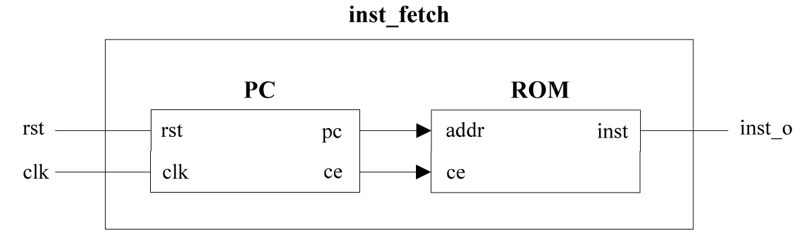

# 预学习

## 顶层模块

| 序号 | 接口名 | 位宽 | 方向 | 作用           |
| ---- | ------ | ---- | ---- | -------------- |
| 1    | rst    | 1    | 输入 | 复位信号       |
| 2    | clk    | 1    | 输入 | 时钟信号       |
| 3    | inst_o | 32   | 输出 | 表示读出的指令 |

## PC模块
给出取指令地址, 同时每个时钟周期取指令地址递增.

|序号   |接口名 |位宽   |方向   |作用   |
|-------|-------|-------|-------|-------|
|1      |rst    |1      |输入   |复位信号|
|2      |clk    |1      |输入   |时钟信号|
|3      |pc     |6      |输出   |指令地址|
|4      |ce     |1      |输出   |使能信号|

## 指令存储器ROM

| 序号 | 接口名 | 位宽 | 方向 | 作用           |
| ---- | ------ | ---- | ---- | -------------- |
| 1    | ce     | 1    | 输入 | 使能信号       |
| 2    | addr   | 6    | 输入 | 指令地址       |
| 3    | inst   | 32   | 输出 | 表示读出的指令 |

## 仿真

1. 编写仿真文件.
2. 运行仿真脚本.
3. 使用gtkwave工具进行波形的查看.

