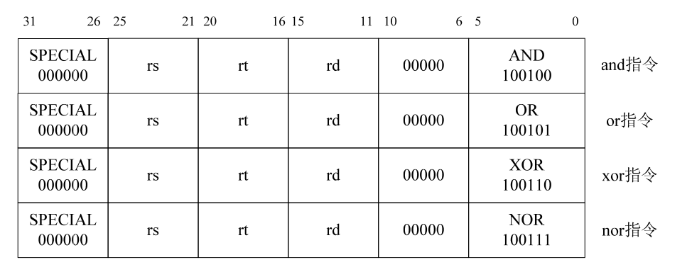
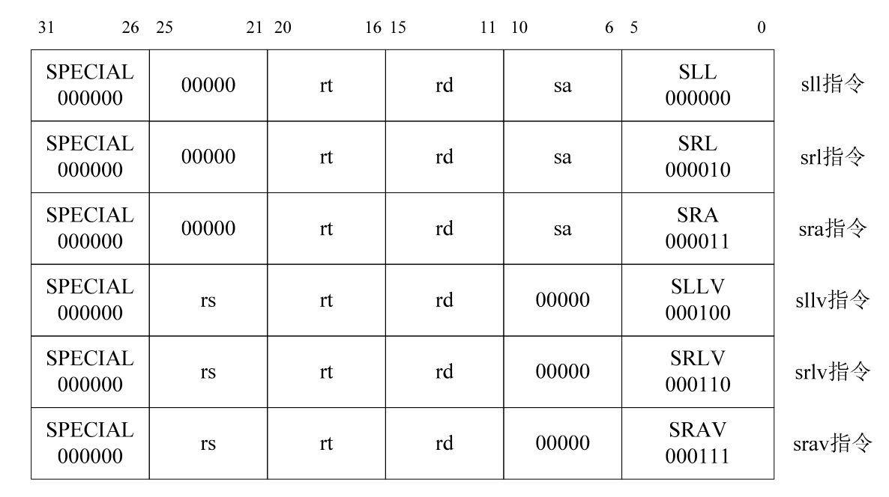
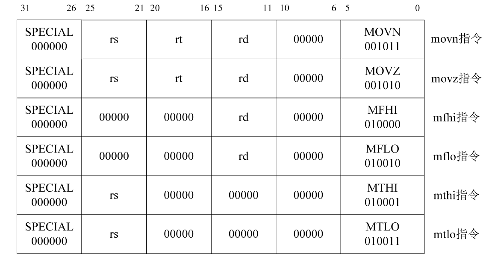
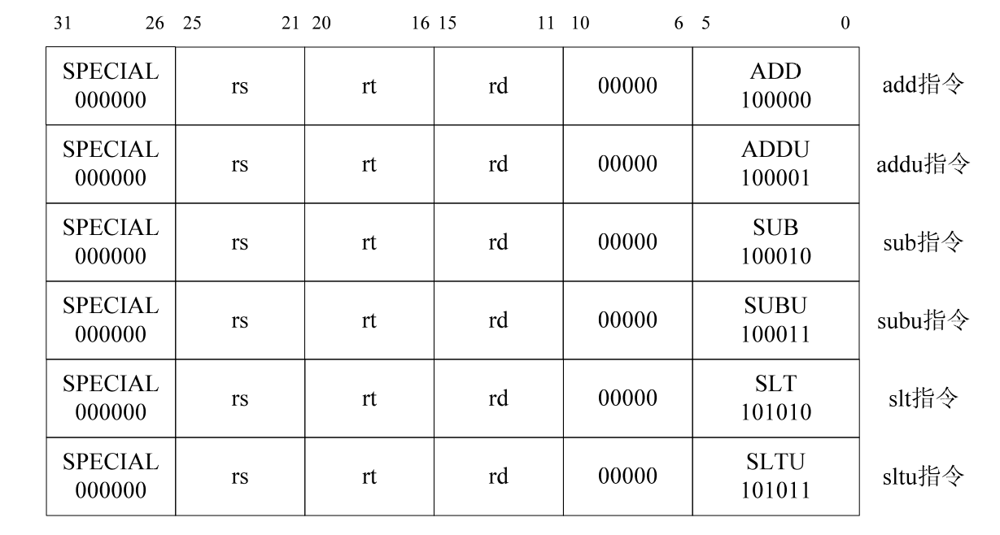
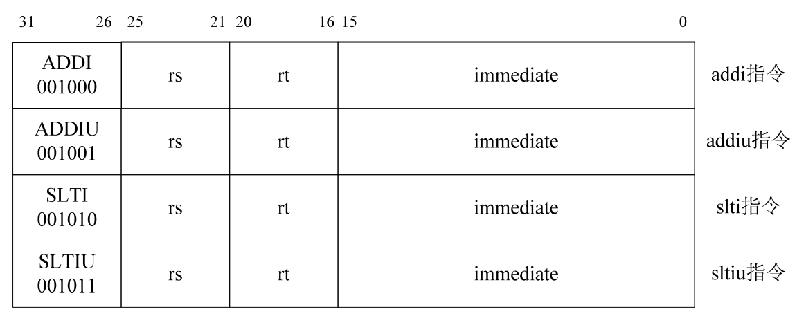
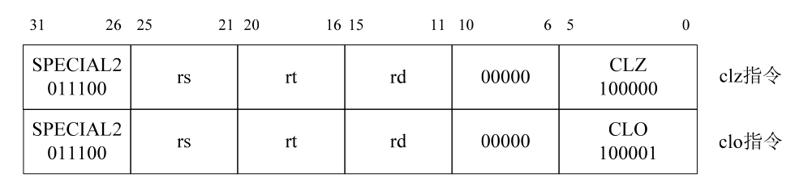
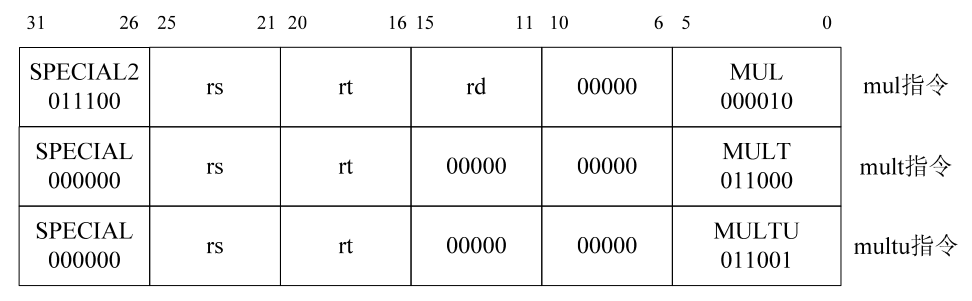

# 《自己动手写CPU》学习记录

## 设计目标

- 五级整数流水线，分别是：取指、译码、执行、访存、回写。
- 哈佛结构，分开的指令、数据接口。
- 32 个 32 位整数寄存器。
- 大端模式。
- 向量化异常处理，支持精确异常处理。
- 支持 6 个外部中断。
- 具有 32bit 数据、地址总线宽度。
- 能实现单周期乘法。
- 支持延迟转移。
- 兼容 MIPS32 指令集架构，支持 MIPS32 指令集中的所有整数指令。
- 大多数指令可以在一个时钟周期内完成。

## 阶段一. 预学习[已完成]

实现: 使用iverilog和gtkwave工具, 实现对verilog的编译和仿真.

## 阶段二. 实现ori(或)指令[已完成]

### ori指令:

## 阶段三. 实现其它逻辑指令和移位指令[已完成]

对数据相关问题进行了修改.

增加了逻辑操作, 移位操作和空指令

指令格式:

## 阶段四. 实现移动操作指令[已完成]

`movn`,`movz`,`mfhi`,`mthi`,`mflo`,`mtlo`

指令格式:

## 阶段五. 实现算术操作指令

`add`,`addi`,`addiu`,`addu`,`sub`,`subu`,`clo`,`clz`,`slt`,`slti`,`sltiu`,`sltu`,`mul`,`mult`,`multu`.

add、addu、sub、subu、slt、sltu 指令格式:

addi、addiu、slti、sltiu 指令格式:

clo、clz 指令格式:

multu、mult、mul 指令格式:

