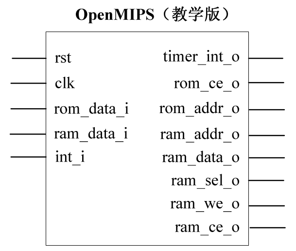
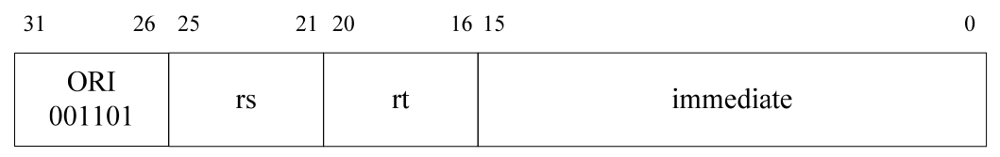

# 《自己动手写CPU》学习记录

## 设计目标

- 五级整数流水线，分别是：取指、译码、执行、访存、回写。
- 哈佛结构，分开的指令、数据接口。
- 32 个 32 位整数寄存器。
- 大端模式。
- 向量化异常处理，支持精确异常处理。
- 支持 6 个外部中断。
- 具有 32bit 数据、地址总线宽度。
- 能实现单周期乘法。
- 支持延迟转移。
- 兼容 MIPS32 指令集架构，支持 MIPS32 指令集中的所有整数指令。
- 大多数指令可以在一个时钟周期内完成。

## 阶段一. 预学习[已完成]

实现: 使用iverilog和gtkwave工具, 实现对verilog的编译和仿真.

## 阶段二. 实现ori(或)指令

### ori指令:

